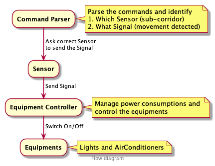

#### EquipmentControlSystem

---

## Problem:

A very prestigious chain of hotels is facing a problem of huge consumption of electricity bills for its electronic equipments. The common equipments, like lights, ACs, etc are currently controlled manually, by the hotel staff, using manual switches. Hotel Management wants to optimise the usage of electricity consumption and also ensure that there is no inconvenience caused to the guests and staff. So, it has installed Motion Sensors at appropriate places and have approached you to program a Controller which takes inputs from these sensors and controls various equipments.

The way the hotel equipments are organised and the requirements for the Controller are listed below:

```
● A Hotel can have multiple floors
● Each floor can have multiple main corridors and sub corridors
● Both main corridor and sub corridor have one light each
● Both main and sub corridor lights consume 5 units of power when ON
● Both main and sub corridor have independently controllable ACs
● Both main and sub corridor ACs consume 10 units of power when ON
● All the lights in all the main corridors need to be switched ON between 6PM to 6AM,
  i.e. the Night Time slot
● By default, all ACs are switched ON, all the time
● When a motion is detected in one of the sub corridors the corresponding lights need to be
  switched ON between 6PM to 6AM (Night Time slot)
● The total power consumption of all the ACs and lights combined should not exceed
  (Number of Main corridors _ 15) + (Number of sub corridors _ 10) units of per floor.
● Sub corridor AC could be switched OFF to ensure that the power consumption is
  not more than the specified maximum value
● When there is no motion for more than a minute the sub corridor lights should be
  switched OFF and AC needs to be switched ON Motion in sub-corridors is input to the controller,
  which needs to keep track and optimise the power consumption.
```

**Write a program** that takes input values for Floors, Main corridors, Sub corridors and takes different external inputs for motion in sub corridors. For each input, the program prints out the state of all the lights and ACs in the hotel. For simplicity, assume that the controller is operating at the Night Time.

Sample input and output below -

```
Configuration Inputs:
● Number of floors: 2
● Main corridors per floor: 1
● Sub corridors per floor: 2

Subsequent Inputs from Sensors:

Default state (when the program is first run)
----------------------------------------------------

Floor 1
Main corridor 1 Light 1 : ON AC : ON
Sub corridor 1 Light 1 : OFF AC : ON
Sub corridor 2 Light 2 : OFF AC : ON

Floor 2
Main corridor 1 Light 1 : ON AC : ON
Sub corridor 1 Light 1 : OFF AC : ON
Sub corridor 2 Light 2 : OFF AC : ON
----------------------------------------------------

Input: Movement in Floor 1, Sub corridor 2

Floor 1

Main corridor 1 Light 1 : ON AC : ON
Sub corridor 1 Light 1 : OFF AC : OFF
Sub corridor 2 Light 2 : ON​ AC : ON

Floor 2

Main corridor 1 Light 1 : ON AC : ON
Sub corridor 1 Light 1 : OFF AC : ON
Sub corridor 2 Light 2 : OFF AC : ON
----------------------------------------------------

Input: No movement in Floor 1, Sub corridor 2 for a minute

Floor 1

Main corridor 1 Light 1 : ON AC : ON
Sub corridor 1 Light 1 : OFF AC : ON
Sub corridor 2 Light 2 : OFF​ AC : ON

Floor 2

Main corridor 1 Light 1 : ON AC : ON
Sub corridor 1 Light 1 : OFF AC : ON
Sub corridor 2 Light 2 : OFF AC : ON
----------------------------------------------------
```

Since the hotel management is trying this for the first time, it would be changing the requirements as to which electronic equipments are controlled and the criteria based on which they are controlled. Therefore, the solution design should be flexible enough to absorb these changes without a need to make significant changes in the program.

---

## Solution:

### Steps to run:

1. Install .Net Core 3.0
   Refer: https://dotnet.microsoft.com/download/dotnet-core/3.0

2. Run following commands in terminal (Assuming you've working git command):
   _To run from a files (via test case)_

   1. `git clone` https://github.com/vkaushik/equipmentControlSystem.git
   2. `cd equipmentControlSystem/controllerTest`
   3. `dotnet test`

   _or To run from console:_

   1. `git clone` https://github.com/vkaushik/equipmentControlSystem.git
   2. `cd equipmentControlSystem/controllerConsole`
   3. `dotnet run`

---

### Implementation:



```javascript
Algorithm to handle event:

    On signal event
        if(eventType == movement)
            allowedPowerConsumption
            futurePowerConsumption
            extraPowerConsumption = allowedPowerConsumption - futurePowerConsumption

            if(extraPowerConsumption > 0)
                accomodateByDecreasingPower(extraPowerConsumption)
                switch on equipments

        else if (eventType == noMovement )
            presentPowerConsumption
            futurePowerConsumption
            changeInPowerConsumption = presentPowerConsumption - futurePowerConsumption

            if(changeInPowerConsumption > 0)
                switch off equipments
                accomodateByIncreasingPower(changeInPowerConsumption)

accomodate increased power consumption
    get switchedOnInactiveSubCorridorAirConditioners
    reducedPowerConsumption = 0
    foreach(ac in switchedOnInactiveSubCorridorAirConditioners)
        if (reducedPowerConsumption >= extraPowerConsumption) break
        ac.switchOff()
        reducedPowerConsumption += ac.power
        equipmentsSwitchedOffToAdjustPowerConsumption.add(ac)

accomodate decreased power consumption
    increasedPowerConsumption = 0
    foreach(equipment in equipmentsSwitchedOffToAdjustPowerConsumption)
        if (increasedPowerConsumption >= changeInPowerConsumption) break
        equipment.switchOn()
        increasedPowerConsumption += equipment.power;
        equipmentsSwitchedOffToAdjustPowerConsumption.remove(equipment)
```

---

Tasks:

- [x] Working code
- [ ] Edge cases handle in test
- [ ] Refactoring (for loops, interfaces)
- [ ] Unit tests
